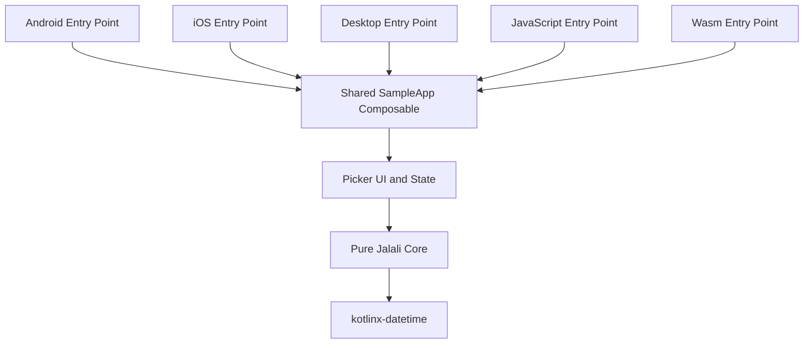

<div align="center">

# Persian Date Picker KMP

### Production-ready Jalali date picker for Compose Multiplatform

A reusable Kotlin Multiplatform library with shared calendar logic and Compose UI  
for Android, iOS, Desktop JVM, JavaScript and WebAssembly.

[](https://github.com/ALISCHILLER/PersianDatePicker-Kmm-Enterprise/actions/workflows/ci.yml)
[](CHANGELOG.md)
[](https://kotlinlang.org/)
[](https://www.jetbrains.com/compose-multiplatform/)
[](#platform-support)
[](LICENSE)

[Features](#features) •
[Installation](#installation-status) •
[Quick Start](#quick-start) •
[Configuration](#configuration) •
[Architecture](#architecture) •
[Testing](#testing-and-quality-gates) •
[Publishing](#publishing)

</div>

---

## Overview

**Persian Date Picker KMP** is a reusable Jalali/Persian date-picker library for Kotlin Multiplatform and Compose Multiplatform.

The project provides:

- A pure shared Jalali calendar engine
- Strongly typed date and range models
- Single-date and date-range selection
- Base and Pro picker components
- High-level production form fields
- Saveable state holders
- Configurable validation and selection policies
- Persian RTL and international LTR layouts
- Common tests
- Dokka documentation
- Maven publication metadata
- A shared showcase application for all supported platforms

The library is built as a product component rather than an Android-only sample. Calendar behavior, selection rules and UI state are implemented in shared code so consuming applications do not need separate date-picker implementations per platform.

---

## Features

### Shared calendar engine

- Jalali-to-Gregorian conversion
- Gregorian-to-Jalali conversion
- Leap-year calculation
- Month-length calculation
- Safe date arithmetic
- Supported-calendar boundary checks
- Persian, Arabic-Indic and Latin digit parsing
- Configurable formatting
- Stable date and range keys
- Ordered and inclusive date ranges

### Picker APIs

- High-level single-date field
- High-level date-range field
- Base single-date picker
- Base date-range picker
- Pro single-date picker
- Pro date-range picker
- Dialog APIs
- Inline picker APIs
- Explicit state-holder APIs
- Saveable state helpers
- Advanced APIs marked with opt-in annotations

### Selection and validation

- Minimum selectable date
- Maximum selectable date
- Disabled dates
- Custom date validators
- Maximum range length
- Validation-window limits
- Same-day range control
- Typed range-validation results
- Nearest selectable date lookup
- Ignore unavailable dates
- Snap to nearest available date
- Fail-fast production configuration validation

### Localization

- Persian strings
- English strings
- Persian digits
- Latin digits
- Persian week layout
- International week layout
- Full RTL and LTR support
- Configurable first day of week
- Configurable weekend behavior

### Product UI

- Adaptive panel sizing
- Compact and comfortable visual density
- Single-month and dual-month range layouts
- Day, month and year selection modes
- Gregorian date hints
- Event markers
- Event legends
- Quick actions
- Today-action de-duplication
- Configurable color palettes
- Material 3 integration
- Dark-theme compatibility
- Stronger accessibility semantics in Pro components

### Engineering and delivery

- Kotlin `explicitApi()` mode
- Shared `commonMain` implementation
- Android release publication
- Desktop, JS, Wasm and iOS publications
- Sources artifacts
- Dokka Javadoc artifact
- Optional in-memory PGP signing
- Local Maven staging repository
- Ubuntu and macOS CI jobs
- Multi-platform sample application
- GPL-3.0 license

---

## Platform Support

| Target | Library | Shared Compose UI | Showcase | CI verification |
|---|:---:|:---:|:---:|:---:|
| Android | ✅ | ✅ | ✅ | Build |
| Desktop JVM | ✅ | ✅ | ✅ | Metadata/tests |
| iOS x64 | ✅ | ✅ | ✅ | Host-dependent |
| iOS Arm64 | ✅ | ✅ | ✅ | Host-dependent |
| iOS Simulator Arm64 | ✅ | ✅ | ✅ | macOS compile |
| JavaScript Browser | ✅ | ✅ | ✅ | Distribution |
| WebAssembly Browser | ✅ | ✅ | ✅ | Distribution |

### iOS target behavior

Apple targets are enabled automatically on macOS. They remain disabled by default on Windows and Linux to avoid resolving Apple source sets and toolchains on unsupported hosts.

On macOS, the library produces a static framework named:

```text
PersianDatePicker
```

The sample application produces:

```text
SampleApp
```

---

## Version Matrix

| Item | Version |
|---|---:|
| Library | `2.4.0` |
| Public API marker | `2.4.0-enterprise-ultra` |
| Kotlin | `2.2.20` |
| Compose Multiplatform | `1.11.0` |
| Android Gradle Plugin | `8.10.1` |
| kotlinx-datetime | `0.8.0` |
| Dokka | `2.2.0` |
| Android compile SDK | `36` |
| Library min SDK | `23` |
| Sample min SDK | `26` |
| JVM target | `17` |

> Before publishing a tagged release, keep the library version, API marker, sample version, changelog and release tag aligned.

---

## Installation Status

The project has Maven publication metadata and a local staging repository, but this repository does **not currently configure a public Maven Central or GitHub Packages destination**.

The intended coordinates are:

```text
groupId:    com.zargroup.persiandatepicker
artifactId: persian-datepicker
version:    2.4.0
```

### Option 1: Publish to local staging

Clone the repository:

```bash
git clone https://github.com/ALISCHILLER/PersianDatePicker-Kmm-Enterprise.git
cd PersianDatePicker-Kmm-Enterprise
```

Publish all host-supported variants:

```bash
./gradlew :persian-datepicker:publishAllPublicationsToLocalStagingRepository
```

Generated artifacts are written to:

```text
persian-datepicker/build/staging-deploy
```

Add that directory as a Maven repository in the consuming project:

```kotlin
dependencyResolutionManagement {
    repositories {
        google()
        mavenCentral()

        maven {
            url = uri("/absolute/path/to/PersianDatePicker-Kmm-Enterprise/persian-datepicker/build/staging-deploy")
        }
    }
}
```

Add the dependency:

```kotlin
commonMain.dependencies {
    implementation(
        "com.zargroup.persiandatepicker:persian-datepicker:2.4.0"
    )
}
```

### Option 2: Use a composite build during development

In the consuming project’s `settings.gradle.kts`:

```kotlin
includeBuild("../PersianDatePicker-Kmm-Enterprise")
```

Then depend on the intended module coordinate after configuring the substitution required by the consuming build.

### Future public installation

After the artifacts are published to a public repository, consumers should only need:

```kotlin
commonMain.dependencies {
    implementation(
        "com.zargroup.persiandatepicker:persian-datepicker:2.4.0"
    )
}
```

Do not present this coordinate as publicly downloadable until a remote release has actually been published.

---

## Quick Start

### Production form fields

For standard application forms, start with the high-level field components.

```kotlin
@Composable
fun BookingForm() {
    var date by remember {
        mutableStateOf<PersianDate?>(null)
    }

    var range by remember {
        mutableStateOf<PersianDateRange?>(null)
    }

    val today = remember {
        PersianDate.today()
    }

    val config = remember(today) {
        PersianDatePickerEnterprisePresets.bookingWindow(
            today = today,
            daysAhead = 60,
            maxRangeLength = 14,
        )
    }

    Column(
        verticalArrangement = Arrangement.spacedBy(12.dp),
    ) {
        PersianDatePickerField(
            selectedDate = date,
            onDateSelected = { date = it },
            label = "Booking date",
            config = config,
            onClear = { date = null },
        )

        PersianDateRangePickerField(
            selectedRange = range,
            onRangeSelected = { range = it },
            label = "Booking range",
            config = config,
            onClear = { range = null },
        )
    }
}
```

These fields manage their own dialog visibility while keeping the selected value controlled by the caller.

---

## Pro Dialog APIs

### Single-date dialog

```kotlin
@Composable
fun SingleDateDialogExample() {
    var isOpen by remember {
        mutableStateOf(false)
    }

    var selectedDate by remember {
        mutableStateOf<PersianDate?>(PersianDate.today())
    }

    Button(
        onClick = { isOpen = true },
    ) {
        Text("Open picker")
    }

    if (isOpen) {
        PersianDatePickerProDialog(
            onDismissRequest = {
                isOpen = false
            },
            onDateSelected = { date ->
                selectedDate = date
                isOpen = false
            },
            initialDate = selectedDate,
            config = PersianDatePickerEnterprisePresets.standardPersian(),
            layoutOptions = DatePickerLayoutOptions(
                panelSize = DatePickerPanelSize.Adaptive,
                density = DatePickerVisualDensity.Comfortable,
                showGregorianHint = true,
            ),
            colors = PersianDatePickerPalettes.royalIndigo(),
        )
    }
}
```

### Date-range dialog

```kotlin
@Composable
fun RangeDialogExample() {
    var isOpen by remember {
        mutableStateOf(false)
    }

    var selectedRange by remember {
        mutableStateOf<PersianDateRange?>(null)
    }

    val config = remember {
        DatePickerConfig(
            constraints = DatePickerConstraints(
                minDate = PersianDate(1404, 1, 1),
                maxDate = PersianDate(1404, 12, 29),
                maxRangeLength = 30,
            ),
            selectionPolicy = DatePickerSelectionPolicy(
                unavailableDateStrategy =
                    UnavailableDateStrategy.SnapToNearestAvailable,
                allowSameDayRange = true,
            ),
        )
    }

    Button(
        onClick = { isOpen = true },
    ) {
        Text("Select range")
    }

    if (isOpen) {
        PersianDateRangePickerProDialog(
            onDismissRequest = {
                isOpen = false
            },
            onRangeSelected = { range ->
                selectedRange = range
                isOpen = false
            },
            initialStartDate = selectedRange?.start,
            initialEndDate = selectedRange?.endInclusive,
            config = config,
            layoutOptions = DatePickerLayoutOptions(
                panelSize = DatePickerPanelSize.Expanded,
                showDualMonthRangeInExpandedPanel = true,
            ),
        )
    }
}
```

---

## Inline Picker

Use the state-holder API when the picker belongs inside a screen, card, dashboard, report filter or bottom sheet.

```kotlin
@Composable
fun InlinePickerExample() {
    val state = rememberSaveablePersianDatePickerState(
        initialSelectedDate = PersianDate.today(),
    )

    PersianDatePickerPro(
        state = state,
        onConfirm = { confirmedDate ->
            // Persist or forward confirmedDate.
        },
        onCancel = {
            state.clearSelection()
        },
        config = PersianDatePickerEnterprisePresets.standardPersian(),
    )
}
```

Range state is also available through:

```text
PersianDateRangePickerState
rememberSaveablePersianDateRangePickerState
```

---

## Core Date API

```kotlin
val date = PersianDate(
    year = 1404,
    month = 1,
    day = 1,
)

val gregorian = date.toGregorian()
val nextWeek = date.plusDays(7)
val safeNextWeek = date.tryPlusDays(7)
val yearMonth = date.yearMonth

val range = PersianDateRange.ordered(
    date,
    date.plusDays(3),
)
```

Main domain types:

```text
PersianDate
PersianYearMonth
PersianDateRange
PersianCalendarEngine
PersianDateFormatter
PersianDateParser
```

The migration alias below preserves compatibility with the original API naming:

```text
SoleimaniDate -> PersianDate
```

---

## Configuration

`DatePickerConfig` centralizes display and selection behavior.

```kotlin
val config = DatePickerConfig(
    strings = DatePickerStrings.persian(),
    digitMode = DigitMode.Persian,
    weekConfiguration = WeekConfiguration.persian(),
    constraints = DatePickerConstraints(
        minDate = PersianDate(1404, 1, 1),
        maxDate = PersianDate(1404, 12, 29),
        disabledDates = setOf(
            PersianDate(1404, 1, 13),
        ),
        maxRangeLength = 30,
        dateValidator = { date ->
            date.dayOfWeek() != DayOfWeek.FRIDAY
        },
    ),
    selectionPolicy = DatePickerSelectionPolicy(
        unavailableDateStrategy =
            UnavailableDateStrategy.SnapToNearestAvailable,
    ),
    quickActions = listOf(
        DatePickerQuickAction.JumpToDate(
            label = "Nowruz",
            dateProvider = {
                PersianDate(1404, 1, 1)
            },
        ),
    ),
)
```

### Main configuration areas

- Strings and localization
- Digit rendering
- Week layout
- Date constraints
- Range constraints
- Date and range formatters
- Event indicators
- Event legends
- Quick actions
- Selection policies
- Layout density
- Panel size
- Gregorian hints
- Theming

---

## Typed Range Validation

```kotlin
val constraints = DatePickerConstraints(
    maxRangeLength = 14,
)

val result = constraints.validateRange(
    start = PersianDate(1404, 1, 1),
    endInclusive = PersianDate(1404, 1, 20),
)

when (result) {
    DatePickerRangeValidationResult.Valid -> {
        // Continue.
    }

    is DatePickerRangeValidationResult.ExceedsMaxRangeLength -> {
        // Show range-length feedback.
    }

    is DatePickerRangeValidationResult.ExceedsValidationWindow -> {
        // Reduce the validation window.
    }

    is DatePickerRangeValidationResult.UnselectableDate -> {
        // Explain which date is unavailable.
    }

    DatePickerRangeValidationResult.CalendarBoundaryExceeded -> {
        // Handle supported-calendar limits.
    }
}
```

Typed results let product code distinguish invalid states without parsing strings.

---

## Selection Policies

Selection behavior belongs to policy and state code rather than individual UI components.

```kotlin
val policy = DatePickerSelectionPolicy(
    unavailableDateStrategy =
        UnavailableDateStrategy.SnapToNearestAvailable,
    allowSameDayRange = true,
)
```

Supported unavailable-date strategies include:

```text
Ignore
SnapToNearestAvailable
```

Canonical interactive mutations are handled through state APIs such as:

```text
PersianDatePickerState.applyTap(...)
PersianDateRangePickerState.applyTap(...)
```

This keeps Base and Pro components behaviorally consistent.

---

## Diagnostics API

Use diagnostics during application startup, CI checks, feature enablement or internal QA.

```kotlin
val report =
    DatePickerConfigValidator.validateProductionReady(config)

if (!report.isReady) {
    report.errors.forEach { issue ->
        println("${issue.code}: ${issue.message}")
    }
}
```

Fail fast when invalid configuration must block startup:

```kotlin
DatePickerConfigValidator.requireProductionReady(config)
```

Diagnostic codes are stable API constants:

```kotlin
if (
    report.hasError(
        DatePickerDiagnosticCode.NoSelectableDate
    )
) {
    // Disable the feature or report invalid configuration.
}
```

---

## Quick Actions

Supported actions:

```text
DatePickerQuickAction.Today
DatePickerQuickAction.ClearSelection
DatePickerQuickAction.JumpToDate
```

Resolved actions are available through:

```kotlin
val actions = config.resolvedQuickActions()
```

When both `showTodayAction` and an explicit `Today` action are provided, duplicate actions are automatically removed.

---

## Events and Legends

```kotlin
val config = DatePickerConfig(
    eventLegend = listOf(
        CalendarEventLegendItem(
            color = Color(0xFF059669),
            label = "Holiday",
        ),
    ),
    eventIndicator = { date ->
        if (date.day == 1) {
            CalendarEvent(
                color = Color(0xFF059669),
                label = "Month start",
            )
        } else {
            null
        }
    },
)
```

Event meanings can be displayed through a first-class legend instead of relying only on marker color.

---

## Theming

Available helpers include:

```text
PersianDatePickerDefaults.colors(...)
PersianDatePickerPalettes.royalIndigo()
PersianDatePickerPalettes.zarEmerald()
PersianDatePickerPalettes.fromColorScheme(...)
DatePickerLayoutOptions
DatePickerVisualDensity
DatePickerPanelSize
```

Use `fromColorScheme(...)` when the picker should inherit a consuming application’s Material 3 color system.

---

## Architecture

The project uses two main modules:



### `:persian-datepicker`

Reusable KMP/CMP library:

```text
commonMain
├── core/
│   ├── date models
│   ├── conversion engine
│   ├── parsing
│   ├── formatting
│   └── date arithmetic
└── ui/
    ├── picker state
    ├── saveable state
    ├── configuration
    ├── constraints
    ├── diagnostics
    ├── field APIs
    ├── base picker
    └── Pro picker
```

### `:sampleApp`

Multi-platform showcase with platform entry points calling the same shared `SampleApp()` composable.

### Architecture rules

- Core calendar logic must not depend on Compose, Android resources or platform APIs.
- UI may depend on Compose Multiplatform and core.
- The sample application may depend on the library.
- The library must never depend on the sample.
- Platform source sets should remain thin.
- Selection rules belong in policy and state code.
- UI components render state and delegate mutations.
- Public APIs remain explicit and typed.

See [ARCHITECTURE.md](ARCHITECTURE.md) for the full design.

---

## Project Structure

```text
PersianDatePicker-Kmm-Enterprise
├── persian-datepicker/
│   ├── build.gradle.kts
│   └── src/
│       ├── commonMain/
│       └── commonTest/
├── sampleApp/
│   ├── src/commonMain/
│   ├── src/androidMain/
│   ├── src/iosMain/
│   ├── src/desktopMain/
│   ├── src/jsMain/
│   └── src/wasmJsMain/
├── iosApp/
├── docs/
├── .github/workflows/ci.yml
├── ARCHITECTURE.md
├── CHANGELOG.md
├── SECURITY.md
├── LICENSE
└── README.md
```

---

## Build and Run

### Requirements

- JDK `17`
- Android Studio or IntelliJ IDEA with Kotlin Multiplatform support
- Android SDK `36`
- macOS and Xcode for iOS compilation
- Browser toolchain dependencies resolved by Gradle for JS/Wasm
- Internet access for the first dependency sync

### Clone

```bash
git clone https://github.com/ALISCHILLER/PersianDatePicker-Kmm-Enterprise.git
cd PersianDatePicker-Kmm-Enterprise
```

### Run tests and generate documentation

```bash
./gradlew \
  :persian-datepicker:allTests \
  :persian-datepicker:dokkaGenerate
```

### Android

```bash
./gradlew :sampleApp:assembleDebug
./gradlew :sampleApp:installDebug
```

### Desktop

```bash
./gradlew :sampleApp:run
```

### JavaScript browser

```bash
./gradlew :sampleApp:jsBrowserDevelopmentRun
./gradlew :sampleApp:jsBrowserDistribution
```

### WebAssembly browser

```bash
./gradlew :sampleApp:wasmJsBrowserDevelopmentRun
./gradlew :sampleApp:wasmJsBrowserDistribution
```

### Compatibility web distribution

```bash
./gradlew :sampleApp:composeCompatibilityBrowserDistribution
```

### iOS on macOS

```bash
./gradlew \
  :persian-datepicker:compileKotlinIosSimulatorArm64 \
  :sampleApp:compileKotlinIosSimulatorArm64
```

---

## Testing and Quality Gates

The common test suite focuses on deterministic calendar and UI-independent behavior.

### Core tests

- Jalali/Gregorian conversion
- Known Nowruz boundaries
- Leap years
- Month lengths
- Supported-year boundaries
- Safe date arithmetic
- Persian, Arabic-Indic and Latin digit parsing
- Formatter contracts
- Date-range ordering and overlap
- Inclusive range length

### Picker logic tests

- Calendar month-grid generation
- Persian RTL week layout
- International LTR week layout
- Date constraints
- Disabled dates
- Custom validators
- Nearest selectable date
- Typed range validation
- Initial selection resolution
- State mutation safety
- Selection policies
- Quick-action resolution
- Today-action de-duplication
- Diagnostics code stability
- Fail-fast configuration validation
- Public field API contracts

### Full host-supported verification

```bash
./gradlew clean \
  :persian-datepicker:allTests \
  :persian-datepicker:dokkaGenerate \
  :sampleApp:assembleDebug \
  :sampleApp:wasmJsBrowserDistribution \
  :sampleApp:jsBrowserDistribution \
  :sampleApp:composeCompatibilityBrowserDistribution
```

On macOS, also run:

```bash
./gradlew \
  :persian-datepicker:compileKotlinIosSimulatorArm64 \
  :sampleApp:compileKotlinIosSimulatorArm64
```

See [docs/TESTING.md](docs/TESTING.md) for the complete strategy and UX smoke checklist.

---

## Continuous Integration

The GitHub Actions workflow contains two jobs.

### Ubuntu job

- Common tests
- Dokka generation
- Android sample build
- JavaScript distribution
- WebAssembly distribution
- Compose compatibility web distribution

### macOS job

- iOS Simulator Arm64 library compilation
- iOS Simulator Arm64 sample compilation

The presence of a workflow file does not by itself prove that a specific commit passed. Confirm the workflow result for the release commit before publishing a badge, tag or package.

---

## Publishing

The `:persian-datepicker` module uses:

- `maven-publish`
- `signing`
- Kotlin Multiplatform publications
- Android release publication
- Sources JARs
- Dokka HTML JAR
- Local staging repository
- Optional in-memory PGP keys

### Generate local publications

```bash
./gradlew \
  :persian-datepicker:allTests \
  :persian-datepicker:dokkaGenerate \
  :persian-datepicker:publishAllPublicationsToLocalStagingRepository
```

### Optional signing

```properties
releaseSigningRequired=true
signingInMemoryKey=<ascii-armored-private-key>
signingInMemoryKeyPassword=<key-password>
```

Signing keys and repository credentials must come from CI secrets or private Gradle configuration.

### Before remote publishing

Verify all of the following:

- Library version, sample version and release tag match.
- The API marker matches the release version.
- `SECURITY.md` lists the actual supported versions.
- POM project URL points to this repository.
- POM SCM URLs point to this repository.
- Developer identity is intentional and authorized.
- GPL-3.0 metadata matches the repository license.
- Apple artifacts are produced on macOS.
- Sources and Dokka artifacts are present.
- Generated POM files contain correct metadata.
- A complete host-supported release gate passes.
- The public repository destination is configured.
- A release tag and changelog entry are created.

See [docs/PUBLISHING.md](docs/PUBLISHING.md) for the publishing workflow.

---

## Security

The library does not process network traffic, credentials, payment data or personal data by default.

Security work is mainly concerned with:

- Correct date validation
- Predictable boundary behavior
- Dependency hygiene
- Safe public API behavior
- Avoiding unsupported platform APIs in shared source sets
- Preventing invalid product configuration from silently reaching users

Security-sensitive date logic should remain covered by deterministic tests.

Report vulnerabilities through GitHub’s private vulnerability-reporting feature when enabled, or contact the maintainer privately.

---

## Current Limitations

- No public Maven Central or GitHub Packages release is configured yet.
- No screenshots or animated product demo are included in the root README.
- Binary compatibility validation is not configured.
- Android/Desktop screenshot testing is not configured.
- Browser Playwright smoke testing is not configured.
- Accessibility checks are primarily manual.
- Performance microbenchmarks are not included.
- The current sample version metadata must be aligned with the library before release.
- `SECURITY.md` supported-version metadata must be updated.
- POM and SCM repository links must be aligned with the actual GitHub repository before remote publication.

---

## Roadmap

- [ ] Publish signed artifacts to Maven Central
- [ ] Align all version metadata
- [ ] Correct POM and SCM repository URLs
- [ ] Update supported versions in `SECURITY.md`
- [ ] Add screenshots for Persian, English, range and dual-month layouts
- [ ] Add an animated multi-platform demo
- [ ] Add binary compatibility validation
- [ ] Add Android and Desktop screenshot tests
- [ ] Add browser Playwright smoke tests
- [ ] Add automated accessibility checks where supported
- [ ] Add performance benchmarks for large validation windows
- [ ] Add golden tests for event markers and expanded range layouts
- [ ] Publish Dokka documentation through GitHub Pages
- [ ] Add release automation and signed GitHub releases
- [ ] Add contribution and issue templates

---

## Documentation

- [Architecture](ARCHITECTURE.md)
- [Changelog](CHANGELOG.md)
- [Testing strategy](docs/TESTING.md)
- [Publishing guide](docs/PUBLISHING.md)
- [Security policy](SECURITY.md)
- [License](LICENSE)

---

## License

This project is licensed under the
[GNU General Public License v3.0](LICENSE).

GPL-3.0 is a strong copyleft license. Review its source-distribution and derivative-work obligations before embedding the library in a distributed application, especially in commercial or closed-source products.

---

## Author

Developed and maintained by
[Ali Soleimani](https://github.com/ALISCHILLER).

Issues, API proposals and pull requests are welcome through GitHub.
